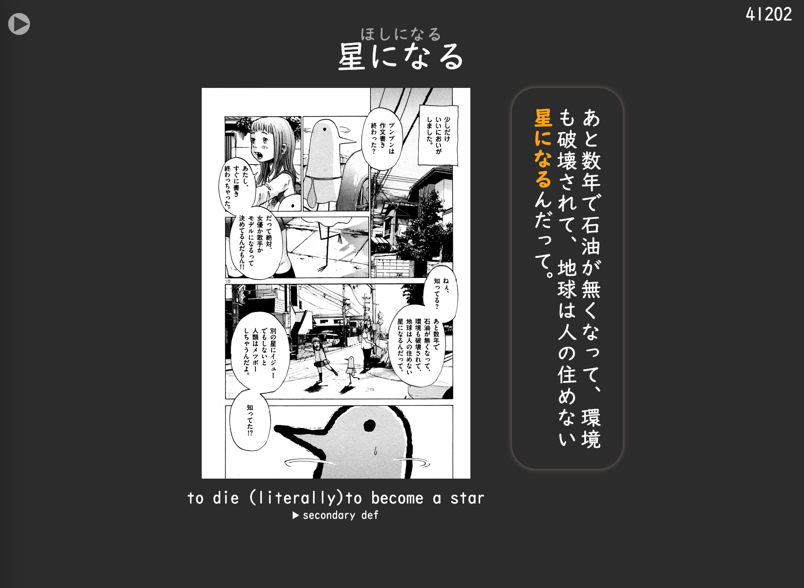
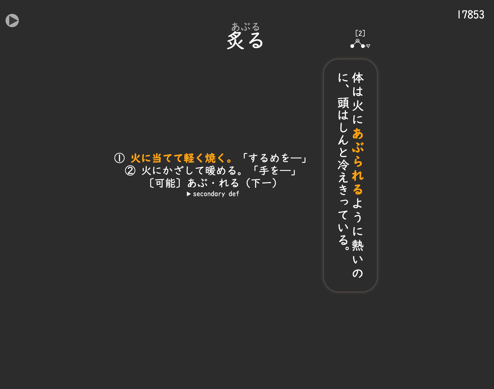
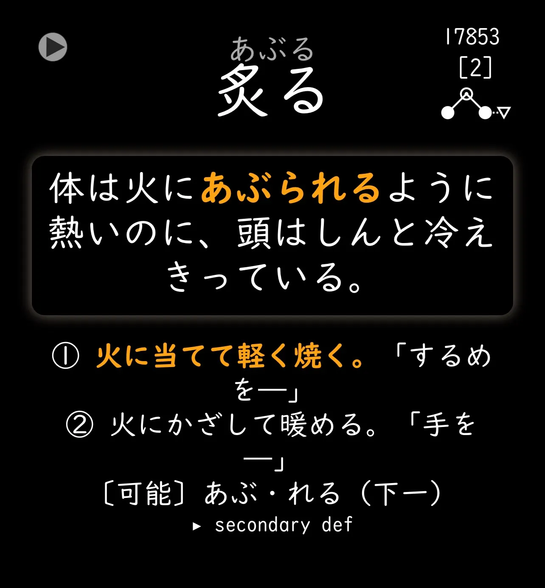
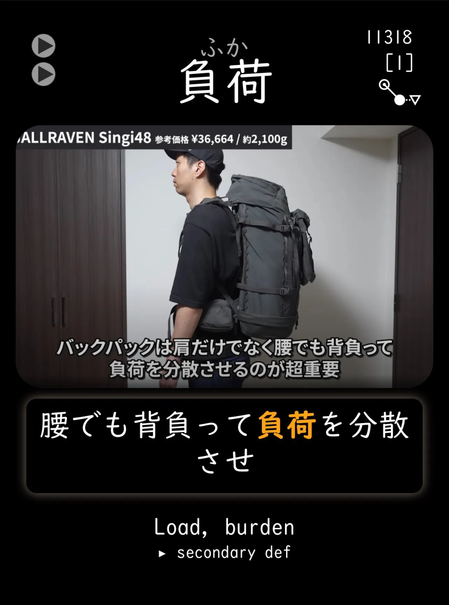
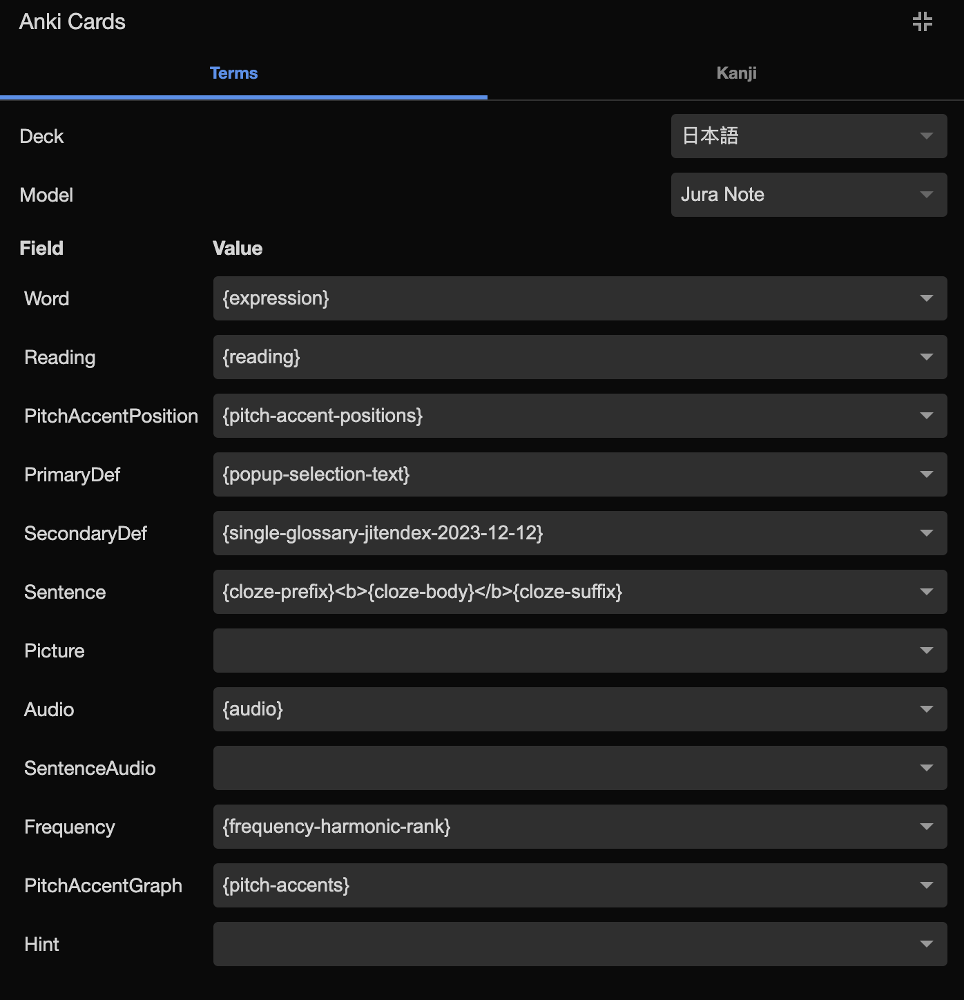

# JuraNote
This card focuses on a simple, responsive layout that looks good on both large and small screens. Due to the nature of the vertical text, this card works extremely well for manga cards especially, but looks good everywhere else. Also has nsfw blurs! Tag your cards with 'nsfw' exactly.

This card was created to be extremely lightweight and simple, making it very easy to edit for your own needs.

## Install

Import the Jura Note Type apkg into your Anki.

## Desktop View

## Mobile View

## Yomitan

Recommended Yomitan

Also recommend setting up handlebars for this card as well, it will eleminate the lists of pitch accents when mining.